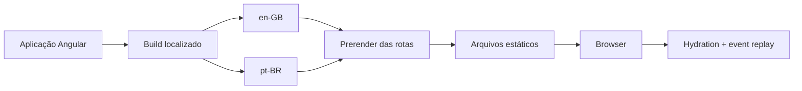

<div align="center">

# Ressutti.dev

**Portfólio profissional bilíngue desenvolvido com Angular moderno, arquitetura orientada a features e geração estática.**

[](https://angular.dev/)
[](https://www.typescriptlang.org/)
[](https://tailwindcss.com/)
[](https://vitest.dev/)
[](#internacionalização)
[](#renderização-e-performance)

[Acessar o portfólio](https://www.ressutti.com) · [English](https://www.ressutti.com/en-gb/) · [Português](https://www.ressutti.com/pt-br/)

</div>

## Sobre o projeto

O **Ressutti.dev** é um portfólio de software criado para apresentar perfil profissional, competências e projetos com uma experiência rápida, responsiva e acessível.

Além da interface, o repositório demonstra decisões de engenharia aplicadas a uma aplicação Angular atual: componentes standalone, reatividade com Signals, carregamento sob demanda por rota, internacionalização nativa, prerenderização, hydration, SEO técnico e TypeScript em modo estrito.

## Destaques técnicos

| Área | Decisões adotadas |
| --- | --- |
| Angular moderno | Componentes standalone, `bootstrapApplication`, `inject()`, Signal Inputs, `output()`, `signal()` e `computed()` |
| Templates | Control flow nativo com `@if`, `@for` e `@switch`, incluindo funções de tracking nas listas |
| Arquitetura | Organização por features, componentes focados, serviços `providedIn: 'root'`, modelos tipados e dados centralizados |
| Roteamento | Lazy loading com `loadComponent`, guard e resolver funcionais, restauração de scroll e navegação por âncoras |
| Renderização | SSG/prerender por rota, parâmetros dinâmicos gerados no build e saída totalmente estática |
| Hydration | Hydration no cliente com event replay para preservar interações durante a inicialização |
| Internacionalização | Angular i18n com builds localizados em `en-GB` e `pt-BR`, rotas traduzidas e troca de idioma contextual |
| SEO | Metadados por página, canonical, `hreflang`, Open Graph, Twitter Cards, JSON-LD, sitemap e robots.txt |
| Acessibilidade | HTML semântico, landmarks, nomes acessíveis, foco visível, suporte a teclado e respeito a movimento reduzido |
| Qualidade | TypeScript e templates estritos, Vitest, Prettier, EditorConfig e budgets de produção |

## Angular moderno na prática

### Componentes standalone

A aplicação não utiliza `NgModules`. Cada componente declara diretamente as dependências de template de que precisa, e o bootstrap é feito com `bootstrapApplication`. Isso reduz configuração indireta, deixa os limites entre componentes explícitos e favorece carregamento granular.

### Signals e APIs modernas de componentes

O estado síncrono da interface é representado com Signals. Exemplos incluem o menu mobile, o tema e o seletor de idioma. Valores derivados usam `computed()`, evitando cálculos repetidos no template.

As APIs modernas `input()` e `output()` definem contratos tipados entre componentes, inclusive com `input.required()` para propriedades obrigatórias.

```ts
public readonly project = input.required<Project>();

protected readonly visibleTechnologies = computed(() =>
  this.project().technologies.slice(0, 5),
);
```

### Injeção de dependências funcional

Serviços e tokens de plataforma são consumidos com `inject()`. Guards e resolvers também seguem o formato funcional do Angular Router, mantendo a configuração de rotas concisa e fortemente tipada.

### Control flow nativo

Os templates utilizam a sintaxe atual do Angular (`@if`, `@for` e `@switch`). As coleções possuem expressões de tracking explícitas, o que ajuda o framework a reutilizar elementos do DOM de forma eficiente.

### Aplicação zoneless

O projeto não depende de `zone.js`. A atualização da interface é conduzida pelas APIs reativas atuais do Angular, reduzindo trabalho implícito de detecção de mudanças e tornando as origens das atualizações mais previsíveis.

## Arquitetura

O código segue uma organização por responsabilidade, mantendo recursos específicos próximos de suas respectivas features e abstrações reutilizáveis nas áreas `core` e `shared`.

```text
src/
├── app/
│   ├── core/
│   │   └── services/          # Serviços de domínio, navegação, contato e SEO
│   ├── features/
│   │   ├── about/             # Página Sobre
│   │   ├── contact/           # Página de Contato
│   │   ├── home/              # Home e suas seções
│   │   ├── not-found/         # Página 404
│   │   └── projects/          # Listagem, detalhes, guard e resolver
│   ├── layout/
│   │   ├── footer/            # Rodapé global
│   │   └── header/            # Cabeçalho, menu mobile e seletor de idioma
│   ├── shared/
│   │   ├── data/              # Conteúdo estruturado da aplicação
│   │   ├── directives/        # Comportamentos reutilizáveis e SSG-safe
│   │   ├── i18n/              # Locales e mapeamento de rotas
│   │   ├── icons/             # Ícones SVG reutilizáveis
│   │   ├── models/            # Contratos do domínio
│   │   └── types/             # Tipos auxiliares
│   ├── app.config.ts          # Providers do browser
│   ├── app.config.server.ts   # Providers de renderização
│   ├── app.routes.ts          # Rotas da aplicação
│   └── app.routes.server.ts   # Estratégias de prerender
├── locale/                    # Catálogo de traduções pt-BR
├── main.ts                    # Bootstrap no browser
└── main.server.ts             # Bootstrap usado no prerender
```

### Separação de responsabilidades

- **Features** encapsulam páginas e componentes específicos de cada fluxo.
- **Layout** reúne a estrutura persistente compartilhada entre as rotas.
- **Core** concentra serviços singleton e preocupações transversais.
- **Shared** contém contratos, dados e elementos realmente reutilizáveis.
- **Dados de conteúdo** ficam separados da apresentação e são validados por modelos TypeScript.

## Renderização e performance

O build de produção usa `outputMode: "static"`. O Angular executa as rotas durante o build e gera HTML estático para publicação; portanto, a aplicação não exige um servidor Node.js ou Express em produção.



As páginas de detalhes de projeto recebem seus slugs de `getPrerenderParams()`, permitindo gerar no build todas as rotas conhecidas. Como fallback, uma rota dinâmica ainda pode ser inicializada no cliente.

Outras decisões voltadas a performance:

- code splitting por rota com `loadComponent`;
- output hashing no build de produção;
- budgets para bundle inicial e estilos de componentes;
- assets estáticos servidos diretamente;
- animações de entrada acionadas por `IntersectionObserver` somente no browser;
- verificação de plataforma antes de acessar APIs exclusivas do navegador;
- ausência de dependência de runtime no servidor para o deploy final.

## Internacionalização

A internacionalização utiliza o pipeline nativo do Angular e `$localize`. Um único build produz duas versões independentes e prerenderizadas:

| Locale | Base URL | Rotas principais |
| --- | --- | --- |
| Inglês britânico (`en-GB`) | `/en-gb` | `/projects`, `/about`, `/contact` |
| Português brasileiro (`pt-BR`) | `/pt-br` | `/projetos`, `/sobre`, `/contato` |

Somente o primeiro segmento funcional da rota é traduzido. Segmentos posteriores — como o slug de um projeto —, query parameters e fragmentos são preservados durante a troca de idioma.

O preview estático também simula a entrada em produção: acessos à raiz são direcionados para o locale adequado a partir da preferência salva ou do cabeçalho `Accept-Language`.

## Roteamento

| Página | Inglês | Português |
| --- | --- | --- |
| Home | `/en-gb/` | `/pt-br/` |
| Projetos | `/en-gb/projects` | `/pt-br/projetos` |
| Detalhes de projeto | `/en-gb/projects/:slug` | `/pt-br/projetos/:slug` |
| Sobre | `/en-gb/about` | `/pt-br/sobre` |
| Contato | `/en-gb/contact` | `/pt-br/contato` |
| Não encontrada | `/en-gb/404` | `/pt-br/404` |

O fluxo de detalhes combina um `CanMatchFn`, que impede a ativação de slugs inexistentes, com um `ResolveFn`, que entrega os dados tipados antes da criação da página.

## SEO técnico

Cada página atualiza seu próprio conjunto de informações sem acoplar essa lógica à camada visual. O serviço de SEO gerencia:

- título e description;
- URL canonical;
- links alternativos com `hreflang` e `x-default`;
- Open Graph e locales alternativos;
- Twitter Cards;
- JSON-LD com tipos adequados ao conteúdo;
- regras de indexação.

O projeto também disponibiliza `sitemap.xml`, `robots.txt` e web manifest entre os arquivos públicos.

## Acessibilidade e experiência

A interface foi estruturada para oferecer uma base inclusiva, sem depender apenas do aspecto visual:

- landmarks e elementos semânticos como `main`, `article`, `section`, `nav` e `aside`;
- associação entre regiões e títulos com `aria-labelledby` e `aria-describedby`;
- estados expostos com atributos como `aria-expanded` e `aria-controls`;
- conteúdo auxiliar para leitores de tela com `sr-only`;
- foco de teclado visível em elementos interativos;
- fechamento de menus por `Escape` e clique externo;
- links externos com indicação acessível e `rel="noopener noreferrer"`;
- layout mobile-first, tema claro/escuro e preferência persistida;
- tratamento de movimento reduzido com `prefers-reduced-motion` nas animações da página de detalhes.

## Tecnologias

### Base da aplicação

- Angular 21
- TypeScript 5.9
- Angular Router
- Angular Localize
- Angular SSR/SSG
- RxJS 7

### Interface

- Tailwind CSS 4
- PostCSS
- design tokens com CSS custom properties
- tema claro e escuro
- layout responsivo mobile-first

### Qualidade e ferramentas

- Vitest 4 com ambiente JSDOM
- Angular TestBed
- TypeScript strict mode
- strict template checking
- Prettier
- EditorConfig
- Angular CLI

## Como executar

### Pré-requisitos

- Node.js `^20.19.0`, `^22.12.0` ou `>=24.0.0`, conforme o suporte do Angular 21
- npm (o projeto declara npm `10.9.1` como package manager)

### Instalação

```bash
git clone https://github.com/welderessutti/ressutti-portfolio.git
cd ressutti-portfolio
npm ci
```

### Ambiente de desenvolvimento

```bash
npm start
```

A aplicação estará disponível em `http://localhost:4200` e será recarregada quando os arquivos forem alterados.

## Scripts disponíveis

| Comando | Descrição |
| --- | --- |
| `npm start` | Inicia o servidor de desenvolvimento do Angular |
| `npm run build` | Gera os builds localizados e prerenderizados de produção |
| `npm run preview:ssg` | Serve localmente o resultado estático já gerado |
| `npm run watch` | Mantém um build de desenvolvimento em modo watch |
| `npm test` | Executa os testes unitários com Vitest |
| `npm run ng -- <comando>` | Encaminha comandos adicionais para o Angular CLI |

### Preview do build estático

```bash
npm run build
npm run preview:ssg
```

Por padrão, o preview fica disponível em `http://localhost:4173`. A saída gerada está em `dist/ressutti-portfolio/browser`, separada por locale.

## Testes e segurança de tipos

Os testes unitários cobrem componentes, serviços, diretiva, guard e resolver. A configuração utiliza Vitest pelo builder oficial do Angular e JSDOM para o ambiente de browser simulado.

Além dos testes, o projeto ativa verificações que antecipam erros durante o desenvolvimento:

- `strict` no TypeScript;
- `strictTemplates` no compilador Angular;
- `strictInjectionParameters`;
- `strictInputAccessModifiers`;
- `noImplicitReturns` e `noFallthroughCasesInSwitch`;
- contratos imutáveis com `readonly` onde aplicável.

## Autor

Desenvolvido por **Welder Ressutti**.

[Portfólio](https://www.ressutti.com) · [GitHub](https://github.com/welderessutti) · [LinkedIn](https://www.linkedin.com/in/welderessutti/)
